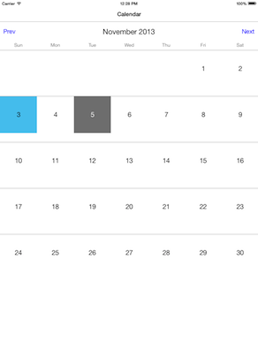
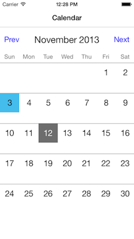

# RDVCalendarView

[](Screenshots/iPad.png)

[](Screenshots/iPhone.png)

* Supports iPad and iPhone
* Supports landscape and portrait orientations
* Highly customizable
* Fully localized using NSLocale

## Installation

### CocoaPods

If you're using [CocoaPods](http://www.cocoapods.org), simply add `pod 'RDVCalendarView'` to your Podfile.

### Drag & Drop

Add the items from `RDVCalendarView` directory to your project. If you don't have ARC enabled, you will need to set a `-fobjc-arc` compiler flag on the `.m` source files.

## Example Usage

See the included demo project.

## Components

* ***RDVCalendarViewController*** - quite simple class, holds ```RDVCalendarView``` instance as its view. Subclass or use as it is. Conforms to ```RDVCalendarViewDelegate``` protocol.

* ***RDVCalendarView*** - build on the principles of UICollectionView and UITableView. If you need custom layout - subclass it and override ```layoutSubviews```. Make sure you call ```[super layoutSubviews]``` inside your implementation.

* ***RDVCalendarDayCell*** - used for the day cells inside ```RDVCalendarView```. It's similar to ```UITableViewCell```. By default contains only ```textLabel```. Add additional subviews to the ```contentView```. Make sure you call ```[super layoutSubviews]``` inside subclass' ```layoutSubviews``` implementation.


## Requirements

* ARC
* iOS 5.0 or later

## Contact

[Robert Dimitrov](http://robbdimitrov.com)  
[@robbdimitrov](https://twitter.com/robbdimitrov)

## License

RDVCalendarView is available under the MIT license. See the LICENSE file for more info.
